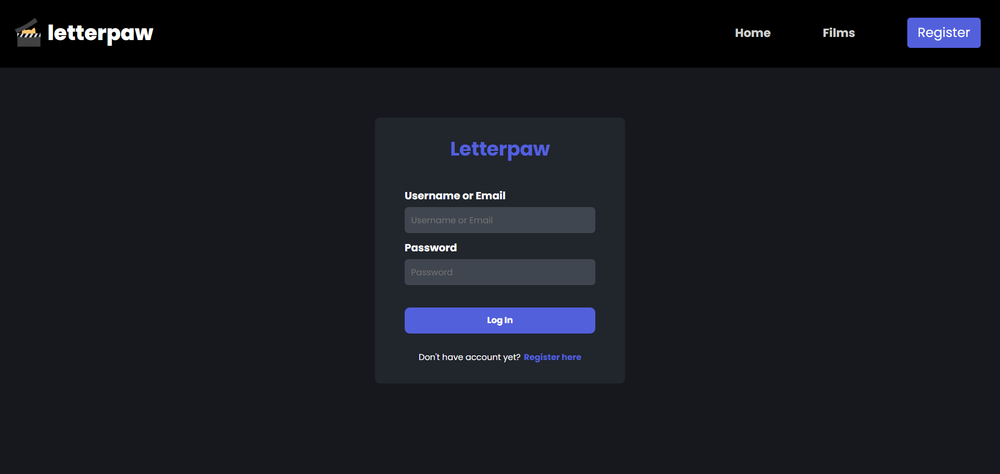
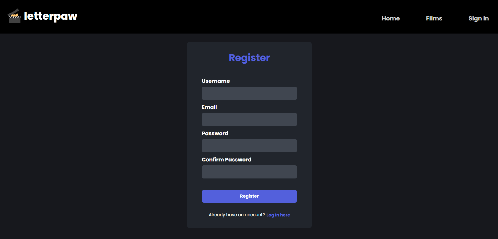
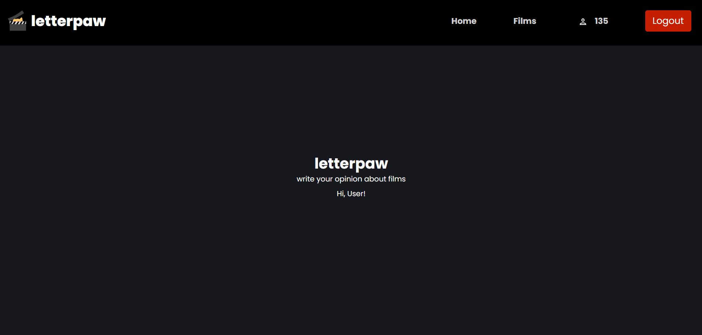
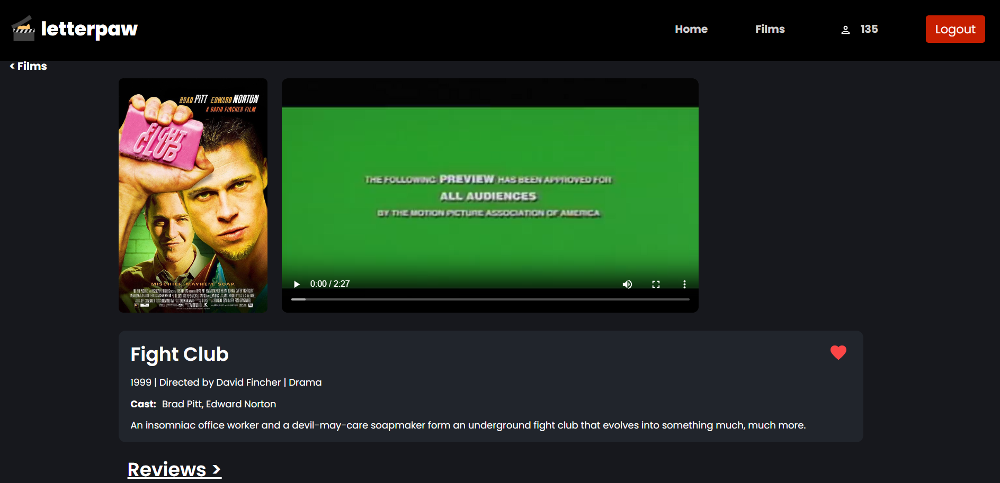
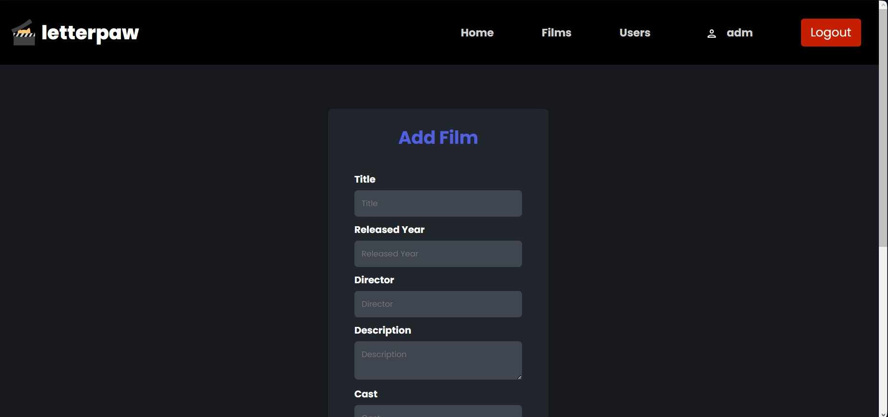
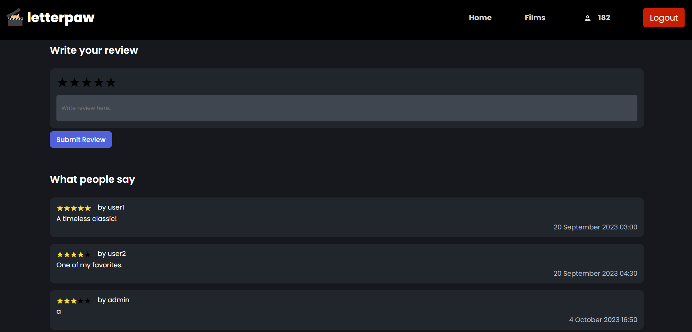
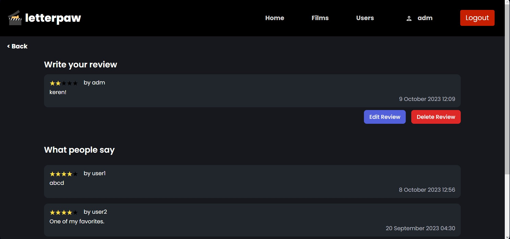
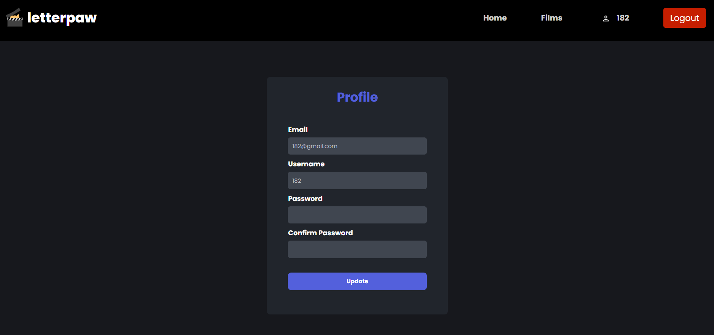
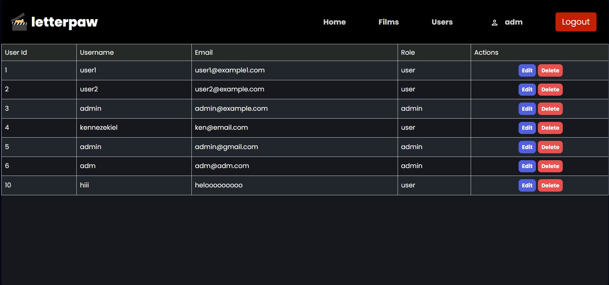

# Letterpaw

> Disusun untuk memenuhi Tugas Besar IF3110 Pengembangan Aplikasi Berbasis Web
> Milestone 1 - Monolithic PHP & Vanilla Web Application

## Daftar Isi

- [Deskripsi Aplikasi](#deskripsi-aplikasi)
- [Daftar Requirement](#daftar-requirement)
- [Cara Instalasi](#cara-instalasi)
- [Cara Menjalankan _Server_](#cara-menjalankan-server)
- [Screenshot Tampilan Aplikasi](#screenshot-tampilan-aplikasi)
- [Pembagian Tugas](#pembagian-tugas)

## Deskripsi Aplikasi

**Letterpaw** adalah sebuah platform sosial yang dirancang khusus untuk pecinta film. Platform ini memungkinkan pengguna untuk membuat memilih film yang mereka telah tonton, memberikan peringkat, dan menulis ulasan tentang film tersebut.

## Daftar Requirement

1. Login
2. Register
3. Home
4. Daftar Film
5. Search, Sort, dan Filter
6. Detail Film
7. Edit Film
8. Daftar Review
9. Edit Review
10. Detail User
11. Edit User

## Cara Instalasi

1. Lakukan pengunduhan _repository_ ini dengan menggunakan perintah `git clone https://gitlab.informatika.org/if3110-2023-k02-01-02/tugas-besar-1.git` pada terminal komputer Anda.
2. Pastikan komputer Anda telah menginstalasi dan menjalankan aplikasi Docker.
3. Lakukan pembuatan _image_ Docker yang akan digunakan oleh aplikasi ini dengan menjalankan perintah `docker build.` pada terminal _directory_ aplikasi web.
4. Buatlah sebuah file `.env` yang bersesuaian dengan penggunaan (contoh file tersebut dapat dilihat pada `.env.example`).

## Cara Menjalankan Server

1. Anda dapat menjalankan program ini dengan menjalankan perintah `docker-compose up` pada terminal _directory_ aplikasi web.
2. Aplikasi web dapat diakses dengan menggunakan browser pada URL `http://localhost:8080/`.
3. Aplikasi web dapat dihentikan dengan menjalankan perintah perintah `docker-compose down` pada terminal _directory_ aplikasi web.

## Screenshot Tampilan Aplikasi

### Login

### Register

### Home

### Daftar Film

### Search, Sort, dan Filter

### Detail Film

### Edit Film

### Daftar Review

### Edit Review

### Detail User

### Edit User

## Pembagian Tugas

1. Login
2. Register
3. Home
4. Daftar Film
5. Search, Sort, dan Filter
6. Detail Film
7. Edit Film
8. Daftar Review
9. Edit Review
10. Detail User
11. Edit User

### _Server Side_

| Fitur                    | NIM      |
| ------------------------ | -------- |
| Login                    | 13521089 |
| Register                 | 13521089 |
| Home                     | 13521089 |
| Daftar Film              | 13521094 |
| Search, Sort, dan Filter | 13521094 |
| Detail Film              | 13521110 |
| Edit Film                | 13521110 |
| Daftar Review            | 13521084 |
| Edit Review              | 13521084 |
| Detail User              | 13521089 |
| Edit User                | 13521089 |

### _Client Side_

| Fitur                    | NIM      |
| ------------------------ | -------- |
| Login                    | 13521089 |
| Register                 | 13521089 |
| Home                     | 13521089 |
| Daftar Film              | 13521094 |
| Search, Sort, dan Filter | 13521094 |
| Detail Film              | 13521110 |
| Edit Film                | 13521110 |
| Daftar Review            | 13521084 |
| Edit Review              | 13521084 |
| Detail User              | 13521089 |
| Edit User                | 13521089 |
